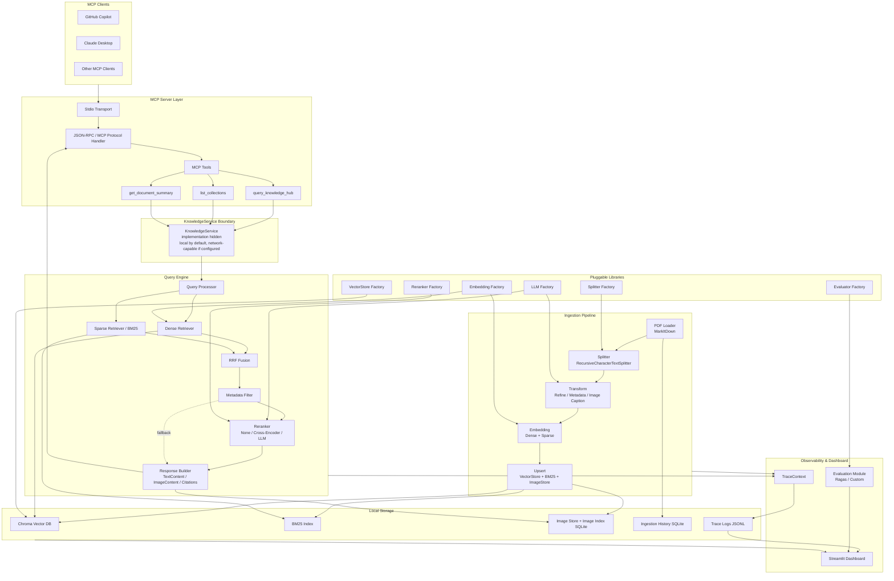
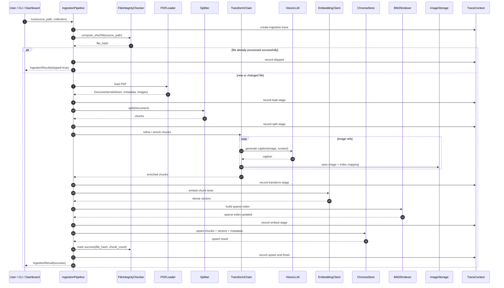
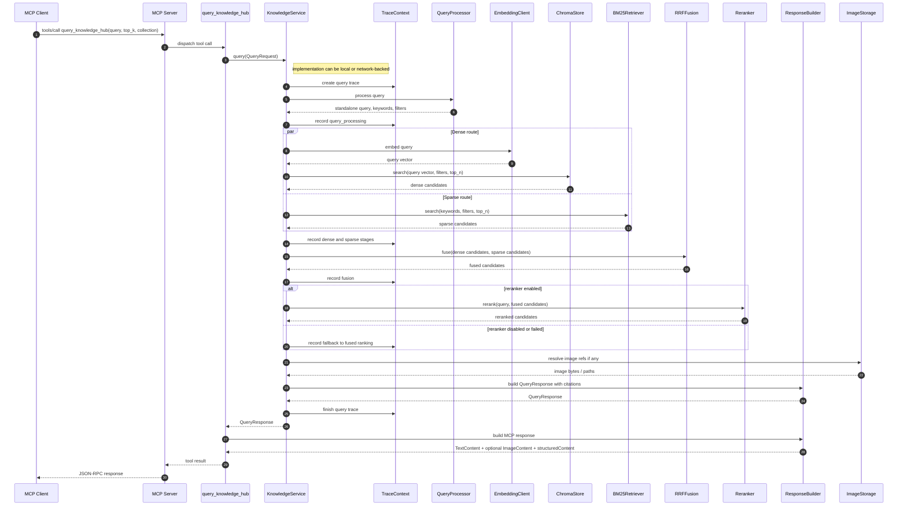
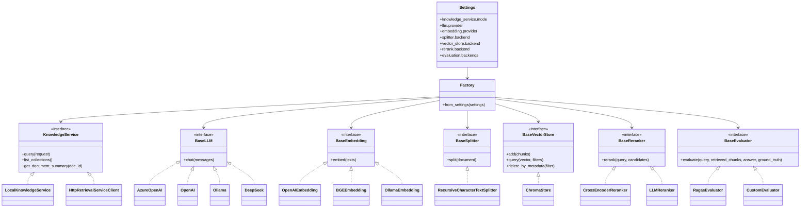
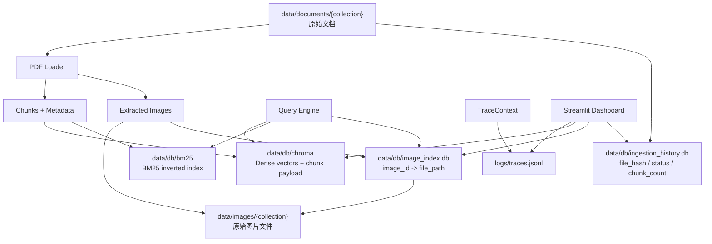
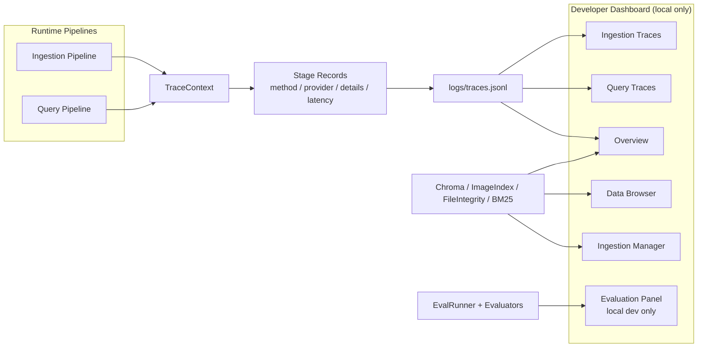
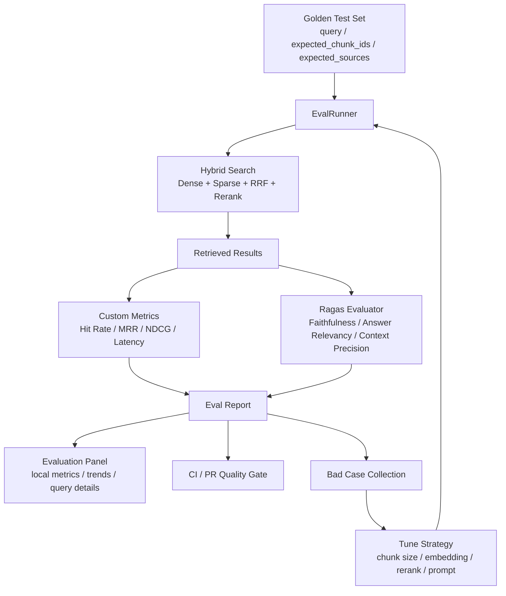
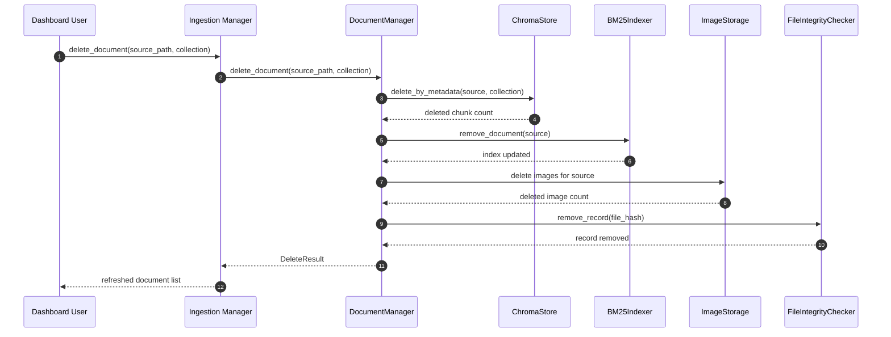

# Modular RAG MCP Server 图集

> 基于 [DEV_SPEC.md](DEV_SPEC.md) 整理。  
> 图使用 Mermaid 编写，可在 GitHub、VS Code Mermaid Preview、Obsidian 等工具中直接渲染。  
> Draw.io 版本已按 `DayuanJiang/next-ai-draw-io` 的 `.drawio` XML 结构生成：[diagrams/modular-rag-mcp-server.drawio](diagrams/modular-rag-mcp-server.drawio)。

Draw.io 文件包含 6 个页面：

- `01 系统架构`
- `02 Ingestion 时序`
- `03 Query 时序`
- `04 混合检索与重排`
- `05 可观测与评测闭环`
- `06 可插拔与配置驱动`

---

## 1. 总体系统架构图

主路径仍是本地 Stdio MCP Server；可选的网络访问能力只出现在 `KnowledgeService` 实现层。

---

## 2. 数据摄取 Ingestion 时序图

---

## 3. 查询 Query 时序图

---

## 4. 混合检索与重排流程图

```mermaid
flowchart LR
  query["User Query"] --> preprocess["Query Processing<br/>standalone query / keywords / filters"]

  preprocess --> dense_embed["Query Embedding"]
  dense_embed --> dense_search["Dense Search<br/>Chroma cosine similarity"]

  preprocess --> keyword["Keyword Extraction<br/>synonym / alias expansion"]
  keyword --> sparse_search["Sparse Search<br/>BM25"]

  dense_search --> dense_top["Dense Top-N"]
  sparse_search --> sparse_top["Sparse Top-N"]

  dense_top --> rrf["RRF Fusion"]
  sparse_top --> rrf

  rrf --> post_filter["Metadata Filter<br/>pre-filter if possible / post-filter fallback"]
  post_filter --> topm["Top-M Candidates"]

  topm --> rerank_choice{"Rerank enabled?"}
  rerank_choice -->|None| final_topk["Final Top-K"]
  rerank_choice -->|Cross-Encoder| cross["Cross-Encoder Scoring"]
  rerank_choice -->|LLM| llmrank["LLM Rerank JSON ids"]

  cross --> final_topk
  llmrank --> final_topk
  final_topk --> citations["Citations + Scores + Source Metadata"]
  citations --> response["MCP Tool Response"]
```

---

## 5. 可插拔组件关系图

---

## 6. 本地存储关系图

---

## 7. 可观测性与 Dashboard 数据流图

Dashboard 仅作为本地开发者工具使用，不注册为 MCP tools，也不作为对外 API 层。

---

## 8. 评估闭环流程图

---

## 9. 文档删除与生命周期管理时序图

