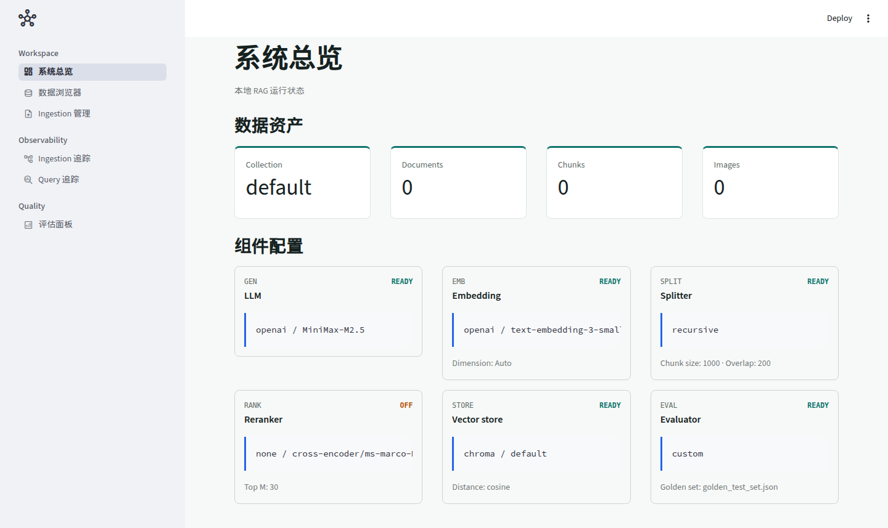

# Modular RAG MCP Server

> 一个可插拔、可观测的模块化知识检索服务，通过 MCP（Model Context Protocol）返回候选 Chunk、来源、分数和关联图片，支持 Copilot / Claude 等 AI 助手直接调用。同时也是一份专为**大模型相关岗位学习与面试求职**设计的实战项目与配套教学资源。

---

## 📖 目录

- [项目概述](#-项目概述)
- [分支说明](#-分支说明)
- [快速开始](#-快速开始)
- [配置说明](#-配置说明)
- [MCP 客户端配置](#-mcp-客户端配置)
- [Dashboard 使用指南](#-dashboard-使用指南)
- [运行测试](#-运行测试)
- [谁适合用这个项目 & 怎么用](#-谁适合用这个项目--怎么用)
- [简历参考](#-简历参考)
- [常见问题](#-常见问题)
- [后续安排](#-后续安排)
- [近期变更（plan 0001）](#-近期变更plan-0001)

---

## 🏗️ 项目概述

### 这个项目是什么

本项目聚焦 RAG 的检索部分：**混合检索（Dense + BM25 + RRF）**、**多模态视觉处理（Image Captioning）**、**可追溯候选结果**和 **Hit@K / MRR 检索评估**，并通过 **MCP（Model Context Protocol）** 对外提供能力。它不生成答案，调用方直接获得带来源和分数的候选 Chunk。

### 运行边界

服务以单个本地实例运行，可被多个 MCP 客户端并发调用。请求不保存应用会话；`request_id`、`actor_key` 和 `session_id` 仅用于请求上下文和 Trace 关联。检索索引、BM25 数据、图片、摄取历史、Trace 和运行配置持久化在该实例的本地存储中，并由连接到同一实例的客户端共享。

项目不内置认证、授权或租户隔离。将服务暴露给不受信任的网络或需要按调用方隔离数据时，需在上层网关和存储边界补充相应控制。

**项目的一大亮点是极易适配到你自己的业务中**。得益于全链路可插拔架构，你可以快速将它结合到自己已有的项目里，无论你的背景和需求如何，都能找到适合自己的使用方式。具体的使用策略会在后文 [谁适合用这个项目 & 怎么用](#-谁适合用这个项目--怎么用) 中详细展开。

### 不只是项目，更是一整套思路

**比这个项目本身更有价值的，是它背后蕴含的一整套工程化思路**：

- 如何编写 **DEV_SPEC**（开发规格文档）来驱动开发
- 如何用 **Skill** 基于 Spec 自动完成代码编写
- 如何用 **Skill** 进行自动化测试、打包、环境配置
- 如何基于可插拔架构进行扩展（比如扩展到 Agent）

**学会了思路，你可以自己做全新的项目和扩展**。以上每一步的具体做法、设计思路，在笔记中都有对应的视频讲解，建议配合观看。

### 核心能力一览

| 模块 | 能力 | 说明 |
|------|------|------|
| **Ingestion Pipeline** | PDF → Markdown → Chunk → Transform → Embedding → Upsert | 全链路数据摄取，支持多模态图片描述（Image Captioning） |
| **Hybrid Search** | Dense (向量) + Sparse (BM25) + RRF Fusion + Rerank | 粗排召回 + 精排重排的两段式检索架构 |
| **MCP Server** | 标准 MCP 协议暴露 Tools | `query_knowledge_hub`、`list_collections`、`get_document_summary` |
| **Dashboard** | React + FastAPI 私有开发控制台 | 系统总览 / 参数配置 / 数据浏览 / 知识检索 / Ingestion 管理 / 链路追踪 / Benchmark |
| **Evaluation** | 真实检索链路评估 | 对比 BM25 / Dense / Hybrid，使用 Hit@5 和 MRR@5 门禁 |
| **Observability** | 全链路白盒化追踪 | Ingestion 与 Query 两条链路的每一个中间状态透明可见 |
| **Skill 驱动全流程** | 从编写到测试、打包、配置一键完成 | auto-coder / qa-tester / package / setup 等 Skill 覆盖完整开发生命周期（笔记中每个 Skill 的使用和设计思路均有讲解，请参考配套视频） |

### 技术亮点

**🔌 全链路可插拔架构**：LLM / Embedding / Reranker / Splitter / VectorStore / Evaluator 每一个核心环节均定义了抽象接口，支持"乐高积木式"替换，通过配置文件一键切换后端，零代码修改。

**🔍 混合检索 + 重排**：BM25 稀疏检索解决专有名词精确匹配 + Dense Embedding 解决同义词语义匹配，RRF 融合后可选 Cross-Encoder / LLM Rerank 精排，平衡查全率与查准率。

**🖼️ 多模态图像处理**：采用 Image-to-Text 策略，利用 Vision LLM 自动生成图片描述并缝合进 Chunk，复用纯文本 RAG 链路即可实现"搜文字出图"。

**📡 MCP 生态集成**：遵循 Model Context Protocol 标准，可直接对接 GitHub Copilot、Claude Desktop 等 MCP Client，零前端开发，一次开发处处可用。

**📊 可视化管理 + 自动化评估**：React + FastAPI 控制台（`web/` + `src/observability/dashboard/api.py`）提供全链路可观测能力（系统总览 / 数据浏览 / Ingestion 追踪 / 查询追踪 / 评估面板），并通过 Golden Set 和真实 Embedding 建立检索回归门禁。

**🧪 三层测试体系**：Unit / Integration / E2E 分层测试，覆盖独立模块逻辑、模块间交互、完整链路（MCP Client / Dashboard）。

**🤖 Skill 驱动全流程**：内置 auto-coder（自动编码）、qa-tester（自动测试）、package（清理打包）、setup（一键配置）等 Agent Skill，覆盖从代码编写到测试、打包、部署的完整开发生命周期。每个 Skill 的使用方法和设计思路在笔记的项目部分均有讲解视频，可参考学习。

> 📖 详细架构设计、模块说明和任务排期请参阅 [DEV_SPEC.md](DEV_SPEC.md)；接口解耦规范见 [DEV_SPEC_INTERFACES.md](DEV_SPEC_INTERFACES.md)，软件工程图见 [INTERFACE_DIAGRAMS.md](INTERFACE_DIAGRAMS.md)。

---

## 📂 分支说明

本项目提供三个分支，面向不同使用场景，请根据自身需求选择：

### `main` — 最干净的完整代码

- 始终只有 **1 个 commit**，包含项目的最新完整代码
- **适合人群**：
  - 想要快速体验项目完整功能的同学
  - 时间紧迫，想要快速拿到一个项目去面试、跳过中间开发过程的同学
  - 想要直接在该项目基础上做二次扩展的同学
- **使用方式**：克隆后直接运行 Setup Skill 即可体验

### `dev` — 保留完整开发记录

- 代码与 `main` 完全一致，但保留了完整的 commit 历史
- 记录了从零开始逐步构建的每一步过程，包含大量中间节点
- **适合人群**：想了解项目是如何一步步从零搭建起来的同学，可以通过 commit 历史回溯开发思路

### `clean-start` — 干净起点，从零开始

- 仅包含工程骨架（Agent Skills + DEV_SPEC），所有任务进度清零
- 保留了完整的 Skill 配置，可以使用 Agent 辅助开发
- **适合人群**：
  - 时间充分、想要从头开发的同学（**强烈建议**）
  - 想要体验完整工作流的同学：写 Spec → 拆任务 → 写代码 → 写测试 → 迭代优化
  - 甚至可以基于自己的理解重新设计架构，用自己的思路实现，深度理解每一个模块
  - 使用我们讲的所有对应思路（Spec 驱动开发、测试先行、可插拔架构等）来完成整个项目
- **核心理念**：整个项目的代码编写是 **让 AI 基于 DEV_SPEC 来自动完成的**，你自己不需要手写代码。AI 通过 Skill 读取 Spec 中的任务定义、架构设计和接口规范，自动生成符合规格的代码。这个思路请参考笔记对应视频讲解：**5.1 项目 Skills 使用：如何让 AI 使用 Skill 遵循 DEV_SPEC 完成代码**。

---

## 🚀 快速开始

下面的手动流程适用于 macOS、Linux 和 WSL。Python 需要 `3.10+`，示例命令均在项目根
目录执行。

### 1. 安装依赖

```bash
git clone <repo-url>
cd MODULAR-RAG-MCP-SERVER
python3 -m venv .venv
source .venv/bin/activate
python -m pip install --upgrade pip
python -m pip install -e ".[dev]"
```

Windows PowerShell 使用 `.venv\Scripts\Activate.ps1` 激活环境。安装完成后，
`modular-rag-mcp`、私有 Dashboard（React + FastAPI）和测试工具都会位于同一个虚拟环境中。

### 2. 配置模型凭据

默认配置使用 OpenAI-compatible LLM 和 OpenAI Embedding。先设置环境变量：

```bash
export MINIMAX_API_KEY="your-minimax-api-key"
export OPENAI_BASE_URL="https://api.minimax.io/v1"
export SGPT_MODEL="MiniMax-M2.5"
export MINIMAX_GROUP_ID="your-group-id" # 仅旧版账号要求
```

`config/settings.yaml` 中的 `${VAR_NAME}` 会在启动时展开。默认的 LLM 和 Embedding 都用
同一把 MiniMax API Key 和区域对应的 Base URL，但调用的是两套独立接口：聊天使用
OpenAI-compatible Chat API，Embedding 使用 MiniMax 原生 `/embeddings` 接口和 `embo-01`。
中国区账号可将 `OPENAI_BASE_URL` 设为 `https://api.minimaxi.com/v1`。旧版 MiniMax 账号若要求
GroupId，可在 `embedding` 下增加 `group_id: ${MINIMAX_GROUP_ID}`。

不要把真实密钥写入 Git 或 MCP 配置模板。桌面应用未必会读取交互式 Shell 配置，后文的
MCP 示例展示了如何显式向子进程传递环境变量。

### 3. 首次摄取

准备一个 PDF，然后执行：

```bash
python scripts/ingest.py \
  --path "/absolute/path/to/your-document.pdf" \
  --collection default
```

也可以把 `--path` 指向包含 PDF 的目录。再次摄取内容未变化的文件会跳过；需要强制生成新
版本时增加 `--force`。成功后，本地数据写入 `data/db/`，图片写入 `data/images/`，Trace
写入 `logs/traces.jsonl`。

从群晖批量导入时，先在 DSM 的“控制面板 → 终端机和 SNMP”中启用 SSH，并确保该用户有
源目录的读取权限。脚本会通过 `rsync` 只同步 PDF 到本地缓存，再调用同一套摄取流水线：

```bash
python scripts/import_synology.py \
  --host nas.local \
  --user your-user \
  --remote-path "/volume1/documents" \
  --collection synology
```

首次连接可能要求确认主机指纹并输入群晖密码；长期使用建议配置 SSH 密钥。再次执行只同步
变化文件，摄取层也会跳过内容未变化的 PDF。可以先加 `--dry-run` 预览。

### 4. 查询并评估

```bash
python scripts/query.py \
  --query "这份文档的核心结论是什么？" \
  --collection default \
  --verbose

python scripts/evaluate.py
```

查询输出包含最终候选、来源和页码；`--verbose` 额外展示 Dense、BM25、RRF 和 Rerank
贡献。评估命令读取 `evaluation.golden_test_set`，也可用
`--test-set path/to/golden.json` 覆盖。

### 5. 启动 Dashboard

```bash
npm ci --prefix web
npm --prefix web run build
python scripts/start_dashboard_api.py
```

浏览器打开 <http://127.0.0.1:8501>。至此 ingest、query、evaluate 和 Dashboard 已形成
一个可复现的本地闭环。

### 一键配置（可选）

本项目提供了 **Setup Skill** 一键完成所有环境配置，包括：Provider 选择 → API Key 配置 → 依赖安装 → 配置文件生成 → Dashboard 启动。

在 VS Code 中打开项目，通过 Copilot / Claude 对话框输入：

```
setup
```

Agent 会自动引导你完成全部配置流程。

> 💡 如果不熟悉 Skill 的使用方式，请观看配套笔记中的 **Setup Skill 使用讲解视频**。

---

## ⚙️ 配置说明

运行时统一读取 [`config/settings.yaml`](config/settings.yaml)。Dashboard 和 MCP 子进程还
支持用 `RAG_SETTINGS_PATH` 指向另一份配置，便于为开发、测试和不同知识库隔离数据。

| 区段 | 关键字段 | 作用 |
|------|----------|------|
| `knowledge_service` | `mode` | MCP 使用的知识服务实现；当前主线为 `local` |
| `llm` | `provider`、`model`、`base_url`、`api_key` | Chunk 精炼、元数据增强和图片描述使用的模型 |
| `embedding` | `provider`、`model`、`api_key` | 摄取和 Dense 查询使用的向量模型 |
| `splitter` | `chunk_size`、`chunk_overlap` | PDF 文本切分大小与重叠窗口 |
| `ingestion` | `batch_size`、`claim_lease_seconds` | 摄取批大小和并发任务租约 |
| `ingestion.loader` | `provider`、`model_version` | PDF 解析器；支持 `markitdown` 和 MinerU 标准 API |
| `ingestion.storage` | `integrity_db_path`、`bm25_path`、`image_*` | SQLite、BM25 和图片持久化位置 |
| `vector_store` | `backend`、`persist_path`、`collection_name` | Dense Vector Store；当前本地实现使用 Chroma |
| `retrieval` | `enable_dense`、`enable_sparse`、`top_k_*` | 召回通道开关及各阶段候选数量 |
| `rerank` | `backend`、`top_m`、`timeout_seconds` | 可选精排及失败回退时间预算 |
| `evaluation` | `backends`、`golden_test_set` | 评估器组合和 Golden Set 路径 |
| `observability` | `enabled`、`log_file` | Ingestion / Query Trace 的 JSONL 输出 |
| `dashboard` | `address`、`port`、`refresh_interval` | Dashboard 监听地址与刷新策略 |

常用检索模式：

```yaml
# 默认混合检索
retrieval:
  enable_dense: true
  enable_sparse: true

# 无 Embedding 服务时仅使用本地 BM25
retrieval:
  enable_dense: false
  enable_sparse: true
```

至少要启用一个召回通道。`top_k_dense` / `top_k_sparse` 控制粗召回规模，
`top_k_final` 控制最终返回规模；Rerank 开启时，`top_m` 决定送入精排的候选数量。

MinerU 解析本地 PDF 时，设置 `MINERU_API_TOKEN`，并在本地配置中选择标准 API：

```yaml
ingestion:
  loader:
    provider: mineru
    model_version: vlm
```

`MinerUPdfLoader` 负责签名上传、任务轮询、结果 ZIP 下载，以及 Markdown、页码、边界框和
Figure/Chart 图片的统一映射。解析失败会终止本次摄取，不会回退到另一解析器。

---

## 🔌 MCP 客户端配置

先确认虚拟环境中的 Server 能启动：

```bash
RAG_SETTINGS_PATH="$PWD/config/settings.yaml" modular-rag-mcp
```

stdio Server 启动后会等待客户端发送 JSON-RPC，请用 `Ctrl+C` 退出。配置中的 `command`
必须使用绝对路径，避免 GUI 客户端找不到虚拟环境；修改配置或环境变量后需要重启 MCP
Server。

### GitHub Copilot（VS Code）

在项目中创建 `.vscode/mcp.json`：

```json
{
  "servers": {
    "modular-rag": {
      "type": "stdio",
      "command": "/ABSOLUTE/PATH/MODULAR-RAG-MCP-SERVER/.venv/bin/modular-rag-mcp",
      "env": {
        "RAG_SETTINGS_PATH": "/ABSOLUTE/PATH/MODULAR-RAG-MCP-SERVER/config/settings.yaml",
        "MINIMAX_API_KEY": "${input:minimaxApiKey}",
        "OPENAI_BASE_URL": "https://api.minimax.io/v1",
        "SGPT_MODEL": "MiniMax-M2.5"
      }
    }
  },
  "inputs": [
    {
      "id": "minimaxApiKey",
      "type": "promptString",
      "description": "MiniMax API Key",
      "password": true
    }
  ]
}
```

打开 VS Code 的 MCP Server 列表并启动 `modular-rag`。客户端应发现：

- `query_knowledge_hub`
- `list_collections`
- `get_document_summary`

### Claude Desktop

编辑 Claude Desktop 配置文件：

- macOS：`~/Library/Application Support/Claude/claude_desktop_config.json`
- Windows：`%APPDATA%\Claude\claude_desktop_config.json`

```json
{
  "mcpServers": {
    "modular-rag": {
      "command": "/ABSOLUTE/PATH/MODULAR-RAG-MCP-SERVER/.venv/bin/modular-rag-mcp",
      "args": [],
      "env": {
        "RAG_SETTINGS_PATH": "/ABSOLUTE/PATH/MODULAR-RAG-MCP-SERVER/config/settings.yaml",
        "MINIMAX_API_KEY": "your-minimax-api-key",
        "OPENAI_BASE_URL": "https://api.minimax.io/v1",
        "SGPT_MODEL": "MiniMax-M2.5"
      }
    }
  }
}
```

Windows 把 `command` 改为 `.venv\\Scripts\\modular-rag-mcp.exe` 的绝对路径。保存后完全退出
并重启 Claude Desktop。可让客户端执行：“调用 `list_collections`，再在 `default` 集合中
查询这份文档的核心结论，并保留引用。”

---

## 📊 Dashboard 使用指南

```bash
npm ci --prefix web
npm --prefix web run build
python scripts/start_dashboard_api.py

# 覆盖配置或监听地址
python scripts/start_dashboard_api.py \
  --settings /absolute/path/settings.yaml \
  --host 127.0.0.1 \
  --port 8502
```

| 页面 | 用途 |
|------|------|
| 系统总览 | 查看数据资产数量及 LLM、Embedding、Splitter、Store、Reranker、Evaluator 配置 |
| 数据浏览器 | 按 Collection 浏览 active generation 文档、Chunk 和图片 |
| 知识检索 | 按 Collection 和 Top K 检索知识片段，展示各召回阶段分数、引用元数据及关联图片 |
| Ingestion 管理 | 后台摄取 PDF、实时查看进度并协调删除跨存储文档 |
| Ingestion 追踪 | 查看摄取历史、状态、耗时和阶段详情 |
| Query 追踪 | 对比 Dense / Sparse 候选、阶段耗时和 Rerank 排名变化 |
| 评估面板 | 使用当前保存的检索配置运行隔离 HotpotQA Benchmark，对比 BM25、Dense 与 Hybrid 指标 |



Dashboard 默认使用快速摄取：保留解析、规则清洗、切块、Dense/BM25 编码和索引写入，
但不逐 Chunk 调用生成模型。需要 LLM 精炼、语义元数据和图片描述时，在提交前开启
`AI 增强`。摄取任务在后台运行，切换页面或刷新浏览器不会阻塞任务；同一进程内会恢复
最近的活动任务及其进度。

`AI 增强` 不包含 Embedding，也不是完成 RAG 摄取的必要条件。开启后，`ChunkRefiner`
逐块清理和重写正文，`MetadataEnricher` 生成 title、summary、tags，`ImageCaptioner`
为图片生成描述并注入关联 Chunk。大文档会产生大量 LLM 调用，因此默认关闭。

Dashboard 默认只监听 `127.0.0.1`。对外暴露前应自行增加认证、TLS 和网络访问控制，不要
直接把本地维护界面绑定到公网地址。

系统总览的每个组件卡片都可以通过设置按钮打开配置窗口。Provider、模型、Endpoint、
切块参数、Reranker 和存储参数保存在 Git 忽略的 `config/settings.local.yaml`；在窗口中
输入的 API Key 单独保存在权限为 `0600` 的 `config/secrets.local.yaml`，不会写入基础配置
或提交到 Git。环境变量优先于本地凭据；Dashboard 保存后立即重载，独立运行的 MCP
Server 需要重启后读取新配置。

---

## 🧪 运行测试

每次运行 Python 或 pytest 前先激活虚拟环境：

```bash
source .venv/bin/activate

# 分层运行
pytest -q tests/unit
pytest -q tests/integration
pytest -q tests/e2e

# 全量回归
pytest -q

# 联网检索准确率评估（使用 settings 中的真实 Embedding 和 Vision Provider）
python scripts/evaluate_retrieval.py

# HotpotQA 现实检索基准（先准备本地已下载的原始数据）
python scripts/prepare_hotpotqa.py
python scripts/evaluate_retrieval.py --dataset hotpotqa

# 静态质量检查
ruff check src scripts tests
mypy src scripts
```

测试全部使用临时目录，不应依赖 `data/` 中的个人索引。E2E 会启动真实 MCP 子进程和
FastAPI TestClient，并通过确定性测试 Embedding 避免调用外部模型 API。
`evaluate_retrieval.py` 不属于默认 pytest；它会实际调用生产配置的 Provider，并在生产配置
所选策略的 Hit@5 低于 90% 或 MRR@5 低于 0.80 时返回非零退出码。

---

## 🎯 谁适合用这个项目 & 怎么用

大家的背景不同——有的校招、有的社招；基础也不同——有的有 AI 项目经验、有的是转方向。因此对于这个项目的使用策略也应该不同，**请一定灵活使用，切忌生搬硬套**。

不过有一点是通用的：**整套项目背后的思路**——如何写 Spec 快速拉起一个项目、如何用 Skill 驱动 AI 自动编码和测试——这些工程化方法论适用于任何项目，值得所有人参考学习。

对于项目本身在不同场景下的使用策略，我会提供一些具体的例子，并以我自己的亲身经历展开——**如果是我自己，面对不同的情况，我会怎么使用这个项目**——给大家作为参考。

### 1. 纯学习 RAG —— 把项目当作 RAG 全流程的学习材料

这个项目本身就是一个完整的 RAG 系统，可以作为学习 RAG 的配套实战项目。

我最开始学习 RAG 的时候，看的是这本书：**《大模型RAG实战：RAG原理、应用与系统构建》**（汪鹏、谷清水、卞龙鹏等人工智能领域专家编著）。你完全可以结合这本书来学习 RAG，书中涉及的典型环节——检索、生成、向量数据库、分块策略、重排序等——其实不管你看哪本 RAG 相关的书，核心内容都是这些。

**这个项目就是把这些步骤串起来了**，所以它可以作为一个通用的 RAG 全流程项目来学习整个过程。你可以配这本书，我相信你也可以配其它的 RAG 书籍，因为流程是通的。面试 RAG 其实也无非是这些过程的组合、原理，以及在实际中遇到的困难和优化。

### 2. 时间紧迫 —— 缺一个项目拿去面试

如果你现在没有 AI 相关项目、急需一个项目去面试，那么可以：

1. **直接使用本项目**，克隆 `main` 分支，用 Setup Skill 跑起来
2. **结合 Resume Writer Skill** 写自己的简历（Skill 会根据你的背景定制化生成项目描述）
3. **尝试理解项目**，跑通核心流程，结合我后续总结的该项目面试问题，先去面试
4. **随着面试深入理解、扩展项目**——面试本身就是最好的学习驱动力

比如现在 3 月份，需要找暑期实习的同学，时间紧迫——先写上去，一边面试一边学习，有时间再扩展。解决你着急面试没有项目的燃眉之急。思路就是：**先写上去 → 去面试 → 根据面试反馈改进项目**。

通常暑期实习从 3 月到 7 月都有机会。找到了实习、有了一个大模型项目经验后，再以此为跳板继续学习——7~10 月秋招，甚至到明年 3 月春招，你有大量的时间持续积累。现在开始虽然看起来有点晚，但其实不晚。如果你能保持学习节奏，从现在到明年 3 月，学习整整一年，校招上岸大模型方向绝对没有问题。**关键在于你自己能不能保持这么长时间的学习力。**

### 3. 时间相对充分 —— 以本项目为起点进行扩展

你可以把这个项目作为起点，根据自己的发展方向进行针对性扩展。DEV_SPEC 中也写了扩展方向，这里列几个常见的：

- **想补充 Agent 知识**：自己实现 Agent 端，做一些上下文处理、Tool Calling、ReAct 逻辑，把本项目作为 Agent 的一个模块和能力，变成一个 **Agent + RAG** 的项目
- **想展示后端工程能力**：加上后端部署能力，写 Dockerfile，做 CI/CD 流水线，加上监控和日志收集
- **想把 RAG 做深入**：扩展到 Agentic RAG、Graph RAG 等高级形态，或者在检索策略上做更多优化实验

每个人发展方向不一样——就像项目配套的 Resume Writer Skill，它写简历的时候会先问你的背景和情况。你定位大模型应用开发工程师、RAG 工程师、全栈工程师，校招、社招的要求都是不一样的（具体大模型不同岗位介绍和技术栈可以看笔记的**大模型岗位介绍**部分），所以需要自己进行针对性扩展。

> **强烈建议**：不管你什么背景、怎么扩展，你大概率需要结合自己的业务来写简历。所以**至少试一下**——把你自己领域的文档（金融、法律、医疗，或者你的业务文档）丢进去，看一下检索效果。如果效果不好，再去调整和改进。这个过程本身就是最好的学习，也是面试时最有说服力的实战经验。

### 4. 时间特别充分 —— 从零体验完整工作流

如果你时间充足，我建议你从 `clean-start` 分支开始，甚至在 `clean-start` 的基础上**删掉 DEV_SPEC**，从文档设计开始，一点点体验：

**文档设计 → AI 写代码 → 改进迭代 → 测试 → 部署**

整个过程的方法论。其中 DEV_SPEC 怎么写、Skill 怎么设计，这些都在笔记项目部分的对应视频中有讲解。你可以重新设计文档、改进文档，甚至直接做 Agent 方向的东西，来走完整个流程。

这样做你会学习到**开发一个项目的完整思路**。这套方法最大的好处是**下限极低**——几乎你都能设计出来、完成整个项目。这样你既学会了思路，又学会了过程，而且项目可以高度定制。群里已经有很多朋友都这么做了。

### 5. 融入现有项目 —— 把 RAG 能力集成到你已有的项目中

这其实也是一种很好的策略，我自己可能也会用这种方式。以我亲身经历现身说法：

我之前找工作时，其实已经有 2 个 Agent 项目了，只是 RAG 流程跑得很粗。我简历上大概的写法是"Agent 项目做了啥，其中涉及了一些 RAG 的知识"。面试的时候，面试官多少都会问 RAG 的内容，然后我和他讲，但因为之前项目的 RAG 系统很浅——其实就是做了一个基本的 Embedding 向量匹配，没有粗排、重排等策略——所以面试官一问就比较浅。

做了这个项目之后，一种处理方式是**把本项目的 RAG 能力融入到之前的 Agent 项目中**，在简历上不作为独立项目，而是作为 Agent 项目的一部分来描述。例如：

> *"……项目中使用自研的模块化 RAG 系统进行知识检索，采用 BM25 + Dense Embedding 混合召回并通过 RRF 融合排序，结合 Cross-Encoder 重排序提升 Top-K 精准度；支持多模态文档处理（PDF 解析 + Image Captioning），通过 MCP 协议暴露标准化工具接口供 Agent 调用。集成 Ragas 评估框架，建立 Golden Test Set 回归测试机制，持续优化检索质量……"*

这样你原有的 Agent 项目就有了 RAG 深度，面试官再问你就有东西可讲了。

### 6. 产品经理 —— 对，你没看错，PM 也可以用这个项目

大模型产品经理面试越来越多地会考 RAG 相关知识，有些公司甚至要求产品经理自己写一个 POC（Proof of Concept）再交给开发。**这个项目和背后的方法论，完全可以帮你做到这一点。**

**为什么 PM 可以用：**

1. **面试需要**：大模型产品岗会考 RAG 的基本原理和流程，你通过这个项目可以直观感受 RAG 的整个过程——从文档摄取、分块、向量化、检索、重排到最终生成，建立起产品层面的理解
2. **POC 能力**：你完全可以用这套方法构建出整个项目——写文档（DEV_SPEC），或者直接用现有的文档，然后用 Skill 让 AI 帮你生成代码。面试的时候你说的是你的思路和产品设计，代码是 AI 帮你写的，这在当下完全合理
3. **不需要关心技术细节**：产品不用关心每一行代码怎么写，但通过跑通这个流程，你能从产品层面思考痛点——比如检索不准怎么定义指标、用户体验上怎么设计反馈机制、数据质量如何影响 RAG 效果等

**具体怎么做：**
- 克隆 `main` 分支，用 Setup Skill 跑起来，体验完整流程
- 把你自己业务领域的文档丢进去，看检索效果，思考产品层面的优化方向
- 面试时讲你的产品思路和设计思考，技术实现部分说明是用 AI 辅助完成的

> 💡 笔记中也提供了 **Vibe Coding** 相关教程（如 Tina Huang 老师的讲解），非常适合非技术背景的同学参考，用 AI 快速构建原型。

### 关于"项目浅"这件事

最后我想独立提一点（这一点适用于上面所有情况）：

**所有项目的深入优化不是一步到位的。**

如果你是转行，项目都是自己做的，多少会遇到面试官觉得你项目浅的问题。我之前也提到过这一点，但不用害怕：

1. **项目深度不是入行的必要条件。** 我去年拿了 6 个 offer，其中包括大厂 offer，即使这样，还是有面试官觉得我项目浅。面试还会考虑很多其他方面——理论基础、算法能力、背景匹配、知识广度等等。不要因为觉得自己转行项目浅就觉得自己转不了。

2. **项目是在不断优化和深入的。** 面试官说你项目浅，你听他的反馈，一定能听出来他为什么觉得浅——比如觉得你数据不够复杂，那你就造一些复杂数据；觉得你图片处理太简单，那你可以扩展多模态策略。我自己也是在面试过程中不断往项目里加东西：我之前做的 Agent 项目，随着面试推进，我往里加了部署、训练、反思数据、评估模块——整个过程都是随着面试同步进行的。

**给自己预留多一点面试时间，一边面试，一边改进和加深。** 所以这里就又提到了整套项目的思路——学会这些思路，你才能持续扩展，而且扩展的门槛很低，都是想好想法让 AI 写嘛，所以不用怕。

说一个真实数据：**这个项目从立项到完成，是我下班后用了大概 2 个月时间做的**，期间我还要上班、做自媒体、自媒体也有其他内容要产出。所以我希望你不要完全指望这个项目作为一个不用扩展就特别深入的项目，特别是社招的同学。但反过来想——两个月的下班时间就做出了这些，如果你学会了这套方法，自己扩展的速度会有多快？

方法都有了，所有的方案、过程、记录都有留档和视频讲解。**最终一定要靠你自己去扩展、迭代，做成最适合你自己的项目。**

---

## 📝 简历参考

> ⚠️ **强烈建议**：请使用项目内置的 **Resume Writer Skill** 来生成你的简历项目经历，而不是直接复制下面的示例。
>
> 简历项目经历**一定是针对性的**——需要结合你自己的业务背景、目标岗位、技术侧重来定制化生成。下面的示例仅用于展示 Skill 的输出效果和不同场景的写法参考，**直接照搬没有任何意义**。
>
> **如何使用 Resume Writer Skill**：在 VS Code 中通过 Copilot / Claude 对话框输入 `写简历` 或 `resume`，Skill 会引导你完成画像采集并自动生成四段式简历。具体使用方式和设计思路请参考笔记中 **项目部分的视频讲解**。

### Resume Writer Skill 工作方式

Skill 采用 **"写作原则 + 项目亮点 + 用户画像 = 定制化简历"** 的三角模型，流程如下：

1. **画像采集**：Skill 会询问你的目标岗位（RAG Engineer / Backend / Agent 等）、业务背景、技术侧重、特殊要求
2. **亮点匹配**：根据你的岗位方向，从项目 10 大技术亮点中筛选 3-5 个最匹配的写入 bullet points
3. **四段式生成**：严格按 **背景 → 目标 → 过程 → 结果** 结构输出，每条 bullet 遵循"动词开头 + 技术细节 + 量化效果"
4. **面试追问预测**：自动生成 3-5 条面试官可能的追问，帮你提前准备

### 经验证的量化项目亮点

- 基于公开 HotpotQA 数据构建包含 120 个查询、1,194 个去重段落的确定性检索基准，
  并通过同一生产检索链路对 BM25、Dense 和 Hybrid 策略进行对比。将 `metadata.title`
  纳入 BM25 稀疏索引后，BM25 的 Hit@5 从 `0.9083` 提升至 `0.9417`，MRR@5 从
  `0.7543` 提升至 `0.8326`，文本查询检索并返回原图的成功用例数从 `2/3` 提升至
  `3/3`；根据评测结果保留 BM25 作为默认生产策略。测试方法、完整指标和迁移要求见
  [实施记录](docs/records/2026-08-09-title-aware-bm25.md)。

### 示例一：校招 · RAG Engineer 方向

> 以下为 Skill 基于"校招、RAG 方向、通用框架模式"生成的示例输出：

**智能知识检索与问答系统** | 2024.09 - 2025.02 | 独立设计与开发

**背景**：针对企业级知识库场景中文档分散、检索精度不足、AI 应用难以接入私有知识的共性痛点，设计并实现了模块化 RAG 检索框架。

**目标**：构建基于混合检索 + MCP 协议的智能知识问答系统，实现精准语义检索与 AI Agent 直接调用私有知识库的能力，将文档问答准确率提升至 90% 以上。

**过程**：
- 设计 BM25 + Dense Embedding 混合召回架构，通过 RRF 融合排序平衡查全率与查准率，结合 Cross-Encoder 重排序将 Top-10 命中率提升约 25%
- 构建全链路 Ingestion Pipeline（PDF 解析 → Markdown → 语义分块 → Metadata 增强 → Embedding → Upsert），集成 Vision LLM 实现图片自动描述并缝合进 Chunk，复用纯文本链路即可"搜文字出图"
- 实现 LLM / Embedding / Reranker / VectorStore 全链路可插拔架构，定义统一抽象接口，通过配置文件一键切换后端 Provider，支持 4+ LLM Provider 零代码切换
- 集成 Ragas + Custom 双评估体系，建立 Golden Test Set 回归测试机制，覆盖 Faithfulness / Relevancy / Recall 等维度，拒绝"凭感觉"调优
- 基于 Skill 驱动全流程开发，通过 auto-coder / qa-tester / setup / package 等 5 大 Agent Skill 覆盖编码、测试、配置、打包完整生命周期，2 个月业余时间完成 68 个子任务的全量交付

**结果**：系统支撑 5000+ 篇文档的实时语义检索，检索准确率（Hit Rate@10）达 92%，端到端查询延迟控制在 800ms 以内，三层测试体系（Unit / Integration / E2E）覆盖 1200+ 测试用例。

**技术栈**：Python / LangChain / ChromaDB / BM25 / Cross-Encoder / MCP Protocol / React / FastAPI / Ragas / Azure OpenAI

### 示例二：社招 · 已有 Agent 项目，融入 RAG 深度

> 以下为 Skill 基于"社招、Agent 方向、Windows 平台开发业务背景"生成的示例输出（将 RAG 能力融入已有 Agent 项目）：

**Windows 平台智能知识助手** | 2024.06 - 2025.02 | 核心开发

**背景**：在 Windows 平台开发团队中，版本发布相关信息（Release Notes、变更日志、补丁公告、兼容性说明等）分散于多个 Wiki、文档仓库和内部系统，工程师排查版本差异或回答客户问题时需跨系统翻找，现有关键词搜索无法理解语义，导致检索效率低、信息遗漏频发。

**目标**：为团队构建基于 Agent + RAG 架构的智能知识助手，实现跨系统文档的语义检索与自动问答，通过 MCP 协议集成至工程师日常工具链（VS Code / Claude Desktop），将文档查找时间缩短 60% 以上。

**过程**：
- 设计 Agent + RAG 分层架构，Agent 端负责意图识别与 Tool Calling，RAG 端提供 BM25 + Dense Embedding 混合召回 + Cross-Encoder 精排的两段式检索能力，通过 MCP 协议暴露标准化工具接口供 Agent 调用
- 实现全链路 Ingestion Pipeline，支持 PDF / Markdown 多格式文档解析，集成 Vision LLM 自动生成图片描述（架构图、截图等），解决"搜文字出图"的多模态检索需求
- 构建可插拔后端架构，LLM / Embedding / Reranker / VectorStore 均定义抽象接口，支持 Azure OpenAI ↔ DeepSeek ↔ Ollama 一键切换，适配团队不同网络环境
- 搭建 React + FastAPI 控制台（系统总览 / 数据浏览 / Ingestion 追踪 / 查询追踪 / 评估面板），实现全链路白盒化可观测
- 集成 Ragas 评估框架 + Golden Test Set 回归测试，在版本迭代中持续监控检索质量，Faithfulness 评分稳定在 0.85 以上
- 采用 Skill 驱动全流程开发模式，编写 DEV_SPEC 规格文档驱动 auto-coder 自动编码、qa-tester 自动测试与修复、setup 一键环境配置，5 大 Agent Skill 覆盖完整开发生命周期，2 个月业余时间完成 68 个子任务交付

**结果**：系统覆盖团队 8000+ 篇技术文档，工程师日均文档查询时间从 15 分钟缩短至 3 分钟，检索准确率 Hit Rate@10 达 90%，已通过 MCP 协议接入 3 个内部 AI 工具，累计处理查询 2 万+ 次。

**技术栈**：Python / Agent / Tool Calling / RAG / BM25 / Dense Retrieval / Cross-Encoder / MCP Protocol / ChromaDB / React / FastAPI / Ragas / Skill-Driven Development / Azure OpenAI

### 示例三：社招 · 后端工程师转 AI 方向

> 以下为 Skill 基于"社招转 AI、后端/架构方向、金融合规业务背景"生成的示例输出：

**合规智能文档检索系统** | 2024.10 - 2025.02 | 设计与主导开发

**背景**：在某金融机构合规部门，法规文件和内部政策文档持续增长至万级规模，合规团队在审查和咨询场景中需要快速定位特定条款，但现有全文搜索系统只能精确匹配关键词，无法理解"反洗钱"与"AML"等语义近义表达，条款定位效率低下。

**目标**：设计并实现模块化 RAG 检索系统，将语义检索能力引入合规文档管理流程，支持近义词、跨语言条款匹配，目标将合规条款定位准确率提升至 90% 以上。

**过程**：
- 主导系统架构设计，采用全链路可插拔架构，LLM / Embedding / Reranker / Splitter / VectorStore 均定义抽象接口与工厂模式，通过 YAML 配置一键切换后端，零代码修改即可适配不同部署环境
- 实现 BM25 稀疏检索 + Dense Embedding 语义检索的混合召回策略，通过 RRF 融合排序兼顾专有名词精确匹配与语义近义匹配，检索准确率较纯向量方案提升 22%
- 构建完整的数据摄取管线，支持 PDF 解析 → 语义分块 → Chunk Refinement → Metadata Enrichment → 向量化存储，实现 DocumentManager 幂等管理，保证文档更新时的数据一致性
- 搭建三层测试体系（Unit / Integration / E2E），覆盖 1200+ 测试用例，集成 Ragas 评估框架建立自动化回归机制，确保迭代过程中检索质量不退化
- 基于 MCP 协议暴露标准化工具接口，支持 GitHub Copilot / Claude Desktop 等 AI 助手直接调用，实现"一次开发、多端调用"的服务化部署
- 实践 Skill 驱动全流程工程化方法，基于 DEV_SPEC 规格文档驱动 AI Agent 自动完成编码（auto-coder）、测试（qa-tester）、环境配置（setup）、清理打包（package），68 个子任务全量由 Agent 交付，开发周期压缩至 2 个月业余时间

**结果**：系统上线后支撑 12000+ 篇合规文档的实时语义检索，条款定位准确率从 68% 提升至 91%，单次查询延迟控制在 700ms，合规团队文档审查效率提升约 50%。

**技术栈**：Python / 可插拔架构 / 工厂模式 / BM25 / Dense Retrieval / RRF / Cross-Encoder / ChromaDB / MCP Protocol / React / FastAPI / Ragas / Skill-Driven Development / Azure OpenAI

---

> 💡 **使用提醒与重要说明**：
>
> **1. 关于放大策略**：Resume Writer Skill 中内置了我设计的**放大策略**——AI 会在合理范围内对你的项目经历进行包装和放大（例如量化指标、业务规模等）。这是我允许的，也是简历写作的正常做法。但这意味着：**生成简历后，你必须想清楚面试官可能针对每一条追问什么、你该怎么回答**。Skill 在生成简历的同时会自动给出 3-5 条面试追问预测，请认真准备这些问题。
>
> **2. 把简历当作实践清单**：简历中写到的每一个技术点，你都应该**真正去试一下**。比如简历写了"检索准确率提升 XX%"——那你就应该在自己的数据上跑一下，看看实际效果如何，过程中遇到了什么问题，你是怎么调优解决的。这些实践经验才是面试时真正有说服力的内容，也是你真正学到东西的过程。简历里没涉及到的部分（比如你没试过多模态、没跑过评估），也可以以此为契机去做代码实验。
>
> **3. 生成的是初稿，请务必结合自身情况修改**：Skill 生成的简历是**初稿**，不是终稿。你需要根据自己的实际情况进行调整——哪些技术你确实深入用过、哪些只是了解、哪些数据需要换成你自己的。简历写作有一条铁律：**写在简历上的东西，你一定要会讲**。即使某个点是放大的，你也要想清楚面试官会怎么问、你怎么自圆其说。说不清楚的东西宁可不写，写上去就要能扛住追问。
>
> **4. 方法比模板更重要**：整个简历编写的思路是我的——包括放大策略、四段式结构（背景 → 目标 → 过程 → 结果 → 技术栈）、亮点匹配逻辑等，这些都沉淀在 Resume Writer Skill 里。如果你有自己更信任的简历模板，或者你对项目做了扩展修改，完全可以去修改 Skill 本身来适配。**学会这套"用 Skill 沉淀方法论、让 AI 按规则执行"的逻辑，比简历本身更有价值**——这个思路可以复用到你未来任何项目的简历编写中。
>
> **5. 强烈建议写上 Skill 驱动全流程**：我个人的意见是，**Skill 驱动全流程开发这个闭环，适合写在任何人的简历上**。Skill 是当下非常热门的方向，已经是面试中的必考内容，很多公司内部也在研究如何用 Skill 加速项目构建。讲清楚你是如何使用 Skill 完成整个项目从编码 → 测试 → 修复 → 配置 → 打包的完整闭环，这本身就是一个比较创新和前沿的亮点，面试官会对此印象深刻。关于 Skill 相关内容在面试中怎么讲、怎么回答追问，我后面也会提供一些例子给大家参考。

---

## 🆕 近期变更（plan 0001）

`mac-local` 分支按 [docs/plans/0001](./docs/plans/0001-production-readonly-rag-component.md)
落地了一轮「内网只读组件」增量，目标是让上层业务系统能直接接入而不是 demo-only。
旧的「Streamlit + JSONL」实现已退役，详细决策见 [ADR 0027](./docs/decisions/0027-readonly-component-and-preference-trace.md)。

**架构差异速览**

| 维度 | 旧实现 | plan 0001 后 |
|---|---|---|
| MCP 传输 | stdio only | stdio + Streamable HTTP |
| 请求身份 | 无 | `X-Request-ID` / `X-RAG-Actor-Key` / `X-RAG-Session-ID` Header（FR-04/13） |
| Trace 持久化 | `logs/traces.jsonl` | `data/db/traces.db`（SQLite WAL） |
| Query Trace 载荷 | 完整候选正文 | compact 模式：剥离 candidates（§6.7）；debug 模式封顶 20 |
| Dashboard | Streamlit 多页面 | React + FastAPI 控制台（`web/` + `src/observability/dashboard/api.py`） |
| 健康检查 | 无 | `/health/live` + `/health/ready`（§5.7） |
| 手动清理 Trace | 无 | `python scripts/purge_traces.py --before / --actor-key` |
| 评估基线 | mock | PostgreSQL 16 教程语料，hybrid recall@5 ≥ 80%（94.29% 当前） |

**怎么验**：

```bash
# 启动 MCP HTTP
python -m src.mcp_server.http_server

# 健康检查
curl http://127.0.0.1:8766/health/live    # {"status": "ok"}
curl http://127.0.0.1:8766/health/ready   # {"status": "ready"|"degraded", "checks": {...}}

# 跑回归评估
.venv/bin/pytest tests/integration/test_postgres_recall.py -v

# 手动清理 trace
python scripts/purge_traces.py --actor-key <key> --dry-run
```

**未动**：教学 / Skill / 简历 / 学习路线章节全部保留，本轮只动了「运行面」。

---

## ❓ 常见问题

---

## ❓ 常见问题

### 1. 如何切换 Provider（比如换成 Qwen / DeepSeek / Ollama）？

**非常简单——直接问 AI 帮你完成即可。**

项目从架构设计上使用了**工厂模式（Factory Pattern）**，Provider 的扩展和切换非常方便。你只需要理解内部原理就会发现：不同 API 本质上都是类似的 HTTP 请求，甚至大多数都遵循 OpenAI 的请求格式，切换起来特别容易。

**具体操作方式有两种：**

1. **使用 Setup Skill（推荐）**：运行一键 Setup Skill，AI 会主动询问你想用哪个 Provider，引导你填入 API Key，然后自动帮你完成代码适配和配置生成。
2. **直接让 AI 帮你改**：把你想切换的 Provider 告诉 AI（如 "帮我切换到 Qwen" 或 "帮我配置 DeepSeek"），AI 能根据工厂模式的架构自动完成代码编写。

> **原理说明**：项目的 `src/libs/` 下的 LLM、Embedding、Reranker 等模块都使用工厂模式，新增一个 Provider 只需要：① 新增一个 Provider 类；② 在工厂注册；③ 更新 `settings.yaml` 配置。AI 完全可以自动完成这些步骤。

### 2. 为什么提示 `missing api_key` 或调用模型失败？

先确认变量在**当前进程**中存在，而不只是写在另一个终端的配置文件里：

```bash
test -n "$MINIMAX_API_KEY" && echo "LLM and Embedding key loaded"
```

然后分别检查 LLM 与 Embedding 的 `base_url`、`model` 和请求协议。MiniMax Chat 与
Embedding 共用 API Key，但聊天模型不能填到 Embedding 配置中，`embo-01` 也不能填到
聊天配置中。MCP 由桌面应用启动时，还需要在 MCP 配置的 `env` 中显式传入变量。

### 3. 为什么查询没有结果？

按顺序检查：

1. 摄取和查询是否使用同一个 `collection`；
2. MCP / Dashboard 是否通过 `RAG_SETTINGS_PATH` 读取了同一份配置；
3. `data/db/` 是否可写，摄取输出是否为“成功”而不是“失败”；
4. Dense 服务不可用时，先设置 `enable_dense: false` 验证 BM25；
5. 查看 `logs/traces.jsonl` 或 Dashboard Query 追踪，区分“零命中”和“召回通道异常”。

若修改过 Chunk 内容并重新摄取，系统会发布新 generation；查询只展示 active generation，
旧版本不会混入结果。

### 4. 想摄取 PDF 以外的文档格式（Word / Markdown / HTML 等）怎么办？

**直接问 AI 帮你扩展即可。**

项目的 Loader 层采用了可插拔的抽象设计（`BaseLoader`），目前默认实现了 PDF Loader。如果你需要支持 Word、Markdown、HTML 等其他格式，整体架构已经设计好了扩展点，让 AI 帮你新增一个对应的 Loader 实现就可以了。

比如告诉 AI："帮我新增一个 Word 文档的 Loader，参考现有的 PDF Loader 实现"，AI 完全可以搞定。

### 5. 如何集成到 AI 工具中（Copilot / Cursor / Claude Code 等）？

优先使用上面的 [MCP 客户端配置](#-mcp-客户端配置)，并检查：

- `command` 是虚拟环境中 `modular-rag-mcp` 的绝对路径；
- `RAG_SETTINGS_PATH` 是绝对路径；
- 没有 Shell 启动信息或普通日志写入 stdout，stdio stdout 只能承载 JSON-RPC；
- 修改配置后已重启客户端中的 MCP Server；
- Server 日志中出现 `Starting modular-rag-mcp`，客户端能列出三个 Tool。

不同客户端的外层配置键可能不同，但核心都是同一个 stdio 子进程：客户端写 stdin，Server
从 stdout 返回 MCP 消息，应用日志写 stderr。

### 6. 通用建议：善用 AI

上述大多数问题（Provider 切换、模块扩展、Bug 修复、架构理解）**AI 都能解决**：

- 🔧 **代码层面**：让 AI 帮你切换 Provider、实现评估方法、修复 Bug
- 📖 **知识层面**：项目架构问题、设计模式问题，都可以问 AI 获取解释
- 🚀 **扩展层面**：想加新功能或适配新场景，描述清楚需求让 AI 帮你实现

> 多问 AI，让它指导你。这也是这个项目想要传达的核心理念之一——**学会与 AI 协作开发**。

---

## 📌 后续安排

### ✅ 会做的
- 项目相关问题的汇总与 FAQ 整理
- 面试高频问题整理与参考答案
- 技术要点讲解（RAG 核心知识、架构设计等）
- 简历包装建议与示范
- **亲身面试实践**：我会带着这个项目去面试，把遇到的问题、怎么回答，都总结到文档中
- **欢迎投稿共建**：如果你用这个项目去面试了，可以把面试录音发给我，我来帮你分析项目相关的问题并写入文档，同时也可以听一下面试整体有哪些改进建议。这样大家能共同进步，一起总结和完善这个项目的面试问答

### ❌ 不会做的
- 不会继续扩展新功能
- 不会处理 Bug Fix、设计优化等
  - 遇到 Bug 和设计上的改进点，请在自己的项目中修复和优化
  - 后续的扩展和修复一定是要靠自己的，而且**有了 AI，这些都很容易做到**
  - 这本身就是一个很好的学习和面试加分项
  - 在理解项目的基础上独立扩展，才是真正的能力体现

### 📝 个人规划说明

我后续会去学习**大模型算法、训练**方向，会把一些笔记和思路总结在笔记中。因此对于这个项目，**不会无限扩展功能或修复 Bug**，但会非常乐意持续做的事情是：

- 总结这个项目在面试中遇到的问题
- 整理如何回答、如何迭代优化的思路
- 把面试问答沉淀到文档中，供大家参考

---

## 📚 配套资源

本项目配有完整的配套学习资源，包括：

- 🎬 **视频讲解**：项目架构设计、Skill 使用、DEV_SPEC 编写、开发全流程演示
- 📝 **面试笔记**：大模型方向面试准备、RAG 核心知识点整理
- ❓ **面试问题参考**：该项目在面试中遇到的真实问题与参考回答
- 📖 **八股整理**：大模型 / RAG / NLP 相关高频面试题

> 👉 **请关注小红书：[不转到大模型不改名](https://www.xiaohongshu.com) 获取以上所有资源。**
