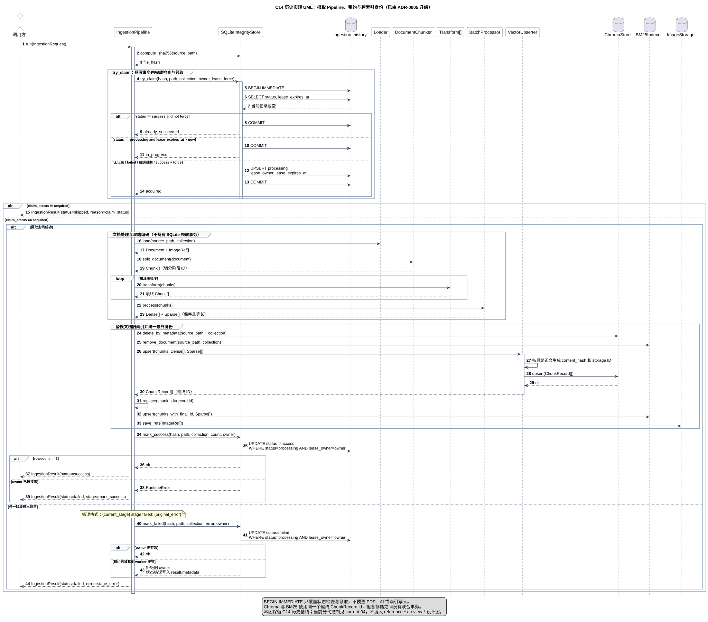

# ADR-0004：摄取 Pipeline 编排、任务租约与跨索引身份

- **状态**：部分被 ADR-0005 取代（保留 C14 历史基线）
- **日期**：2026-07-30
- **决策范围**：摄取阶段顺序、同文件任务领取、失败恢复、Dense/BM25 身份对齐和跨存储边界

> 本文记录 C14 初次落地时的实现。Pipeline 阶段编排和 Dense/BM25 最终 ID 对齐仍然有效；
> `file_hash + collection` 领取、按路径先删后写以及仅靠 owner 提交状态的机制，已由
> [ADR-0005](0005-ingestion-generation-state-machine.md) 的 `doc_key + source_revision`、
> generation fencing、不可变分代写入和 active_generation CAS 发布取代。

## 背景

早期 Pipeline 使用 `should_skip()` 检查成功记录，再调用 `mark_processing()` 写入状态。
这是两个独立数据库操作：两个请求可能同时检查到“尚未成功”，随后都进入 PDF 解析、
Transform 和模型调用。SQLite WAL 能保证数据库文件不被并发写坏，但不能保证同一任务
只执行一次。

C14 将摄取主线统一为：

```text
integrity -> load -> split -> transform -> encode -> store -> mark_success
```

Pipeline 负责顺序和失败边界；Loader、Chunker、Transform、编码器和存储组件仍通过既有
端口或组件注入，不把供应商创建和全局配置塞进编排层。

## 端到端流程

一次成功摄取按以下顺序执行：

1. 对源文件计算 SHA256，并以 `file_hash + collection` 作为摄取历史身份。
2. 调用 `try_claim()` 原子检查并领取任务。
3. Loader 把源文件转换为规范 `Document`，并提供文档级图片引用。
4. `DocumentChunker` 生成有序 `Chunk`；Transform 按注册顺序串行修改 Chunk。
5. `BatchProcessor` 按批次生成等长、保序的 Dense 向量和 Sparse 词频统计。
6. 按 `source_path + collection` 清理该文档旧的 Chroma 与 BM25 记录。
7. `VectorUpserter` 根据最终正文生成存储 ID，构造 `ChunkRecord` 并写入 Chroma。
8. Pipeline 用返回的 `ChunkRecord.id` 替换 BM25 输入 Chunk 的切分阶段 ID。
9. BM25 写入与 Dense 相同身份的 Chunk，`ImageStorage` 保存 Loader 产出的图片引用。
10. 只有当前 lease owner 可以把摄取历史从 `processing` 提交为 `success`。

C14 历史实现的时序 UML：



可编辑源文件：
[`diagrams/current-03-ingestion-pipeline-and-lease.puml`](../../diagrams/current-03-ingestion-pipeline-and-lease.puml)

## 原子任务领取

`try_claim()` 返回三个明确结果：

| 返回值 | 数据库条件 | Pipeline 行为 |
|--------|------------|---------------|
| `acquired` | 无记录、上次失败、租约过期，或 `success + force` | 进入耗时摄取流程 |
| `already_succeeded` | 已是 `success` 且没有 `force` | 返回 `status=skipped`，不解析文件 |
| `in_progress` | 另一个 owner 的 `processing` 租约仍有效 | 返回 `status=skipped`，不抢占任务 |

领取使用短 `BEGIN IMMEDIATE` 事务：事务内读取当前行，完成条件判断和
`processing` upsert，随后立即提交。PDF 解析、模型调用、批量编码和索引写入期间不
持有 SQLite 事务锁。

`force=True` 只允许重新领取已经成功的记录，不能绕过另一个任务的有效租约。

## 租约与旧 owner 保护

领取记录保存：

```text
lease_owner       本次 worker 的唯一身份
lease_expires_at  允许其他 worker 接管的时间点
```

最终状态不是无条件 upsert，而是条件更新：

```sql
WHERE file_hash = ?
  AND collection = ?
  AND status = 'processing'
  AND lease_owner = ?
```

假设 A 领取后崩溃，租约过期后 B 接管；即使 A 随后恢复，它也无法提交 B 的成功或
失败状态。条件更新影响零行时，完整性存储明确拒绝旧 owner，而不是静默覆盖。

C14 以前创建的 SQLite 数据库可能没有租约列。初始化会检查表结构，并使用
`ALTER TABLE ADD COLUMN` 补充 `lease_owner` 和 `lease_expires_at`，保留已有成功、
失败和 processing 记录。旧 processing 行没有有效租约，因此允许新 worker 接管。

## BatchProcessor 与最终身份

Pipeline 不再直接分别调用 Embedding 和 SparseEncoder，而是把最终 Chunk 列表交给
`BatchProcessor`：

```text
有序 Chunk[]
    -> 按 batch_size 分批
    -> DenseEncoder + SparseEncoder
    -> 校验每批输出数量
    -> 保序合并 Dense[] 与 Sparse[]
```

切分阶段 ID 反映的是 C4 生成 Chunk 时的正文；ChunkRefiner 或 ImageCaptioner 可能在
后续修改正文，MetadataEnricher 则可能补充 metadata。`VectorUpserter` 因此基于最终
正文生成新的存储 ID，并返回与输入顺序一致的 `ChunkRecord[]`。

Pipeline 使用 `dataclasses.replace(chunk, id=record.id)` 构造 BM25 输入，不改变正文、
metadata、位置或来源信息。最终满足：

```text
Chroma SearchHit.id == BM25 SearchHit.id == 最终 ChunkRecord.id
```

这项约束使 Hybrid Search 能判断两路结果是否指向同一个 Chunk，并进行 RRF 融合。

## 文档更新与写入顺序

正文变化会产生新的内容哈希和最终 ID，普通 upsert 不会自动删除旧 ID。当前 Pipeline
在写入新版本前，按 `source_path + collection` 删除旧 Chroma 记录和旧 BM25 文档，
再写入新版本。

该顺序保证成功结束后不会同时检索到同一路径的新旧 Chunk，但不构成 Chroma、BM25、
图片文件、图片 SQLite 和摄取历史之间的联合事务。任一存储失败时，Pipeline 记录
`failed`，后续重新摄取会再次执行文档级清理和幂等写入。

## 错误边界

Pipeline 在进入每个阶段前更新 `current_stage`。异常返回统一 `IngestionResult`，错误
信息保留原异常并增加阶段前缀，例如：

```text
load stage failed: parse exploded
encode stage failed: dense batch output count must match chunk count
store stage failed: image file must exist
```

只有已经获得 `acquired` 的任务会尝试 `mark_failed()`。如果任务失败时租约已被接管，
旧 owner 的失败提交会被拒绝；原始阶段错误仍然返回，状态记录错误放入 result metadata。

## 当前决策

1. 使用 SQLite 短事务和租约实现本地同文件领取，不引入 Redis、队列或分布式锁。
2. 租约只覆盖任务所有权，不在 PDF 解析或模型调用期间持有数据库锁。
3. Pipeline 复用 `BatchProcessor` 和 `VectorUpserter`，不重复批处理、内容哈希或记录构造。
4. 最终 `ChunkRecord.id` 是 Dense/BM25 跨索引身份的唯一来源。
5. 文档更新采用“按文档清理旧索引，再幂等写入新索引”的可重试策略。
6. 阶段失败返回领域结果并记录明确阶段，不把底层适配器异常直接泄漏为无上下文错误。

## 已知顾虑与残余风险

| 顾虑 | 可能后果 | 当前控制 | 后续处理 |
|------|----------|----------|----------|
| 租约没有心跳续期 | 单次摄取超过 `claim_lease_seconds` 后可能被新 worker 接管 | 默认租约 900 秒；旧 owner 不能提交最终状态 | 实际出现长任务后增加 `renew_lease()`，不要提前引入后台续租线程 |
| 领取身份是 `file_hash + collection` | 同一路径的两个不同内容版本理论上可以分别领取并并发写同一文档范围 | 正常请求在领取前读取当前文件哈希；存储前按路径清理 | 出现文件热更新并发后增加路径级版本检查或文档锁 |
| Chroma、BM25、ImageStorage 和摄取历史没有联合事务 | 中途失败可能留下部分更新 | 失败状态可重试；Vector/BM25 按文档清理并幂等重建 | 强一致需求出现时引入显式 staged/committed 状态或统一事务存储 |
| 清理旧索引发生在新索引写入前 | 写入失败到重试成功之间，该文档可能暂时不可检索 | Pipeline 返回 failed，不会错误标记 success | 需要在线无中断更新时采用版本化索引和提交指针切换 |
| 重新摄取只 upsert 当前图片引用，不清理旧图片 | 文档删图后可能残留旧映射或孤立文件 | 新图片 ID 和路径确定，当前写入不会破坏新文件 | 由 DocumentManager 或 ImageStorage 的文档级 replace 操作统一处理 |
| `source_path` 尚未统一规范化 | 相对路径、绝对路径和符号链接可能形成不同清理范围 | 同一轮 Pipeline 始终传递同一字符串 | 在 CLI/DocumentManager 边界规范化路径并提供历史迁移策略 |
| 跨存储更新期间可被查询线程观察 | 查询可能短暂看到单路索引或空结果 | 当前定位为本地离线摄取 MVP | 需要在线写入时增加索引版本、读快照或提交屏障 |

这些边界意味着当前实现适合本地、单机、离线或低并发摄取，但不能据此声称拥有
分布式 exactly-once 执行或跨存储事务。

## 验证证据

- `tests/unit/test_file_integrity.py` 覆盖双线程仅一个 owner 领取成功、有效租约拒绝、
  过期接管、force 边界、旧 owner 提交失败和旧数据库迁移。
- `tests/integration/test_ingestion_pipeline.py` 使用真实 SQLite、Chroma、BM25 和
  ImageStorage 验证完整编排、Dense/BM25 ID 一致、旧索引替换、图片落盘、成功跳过和
  阶段失败记录。
- C14 全量回归结果：`165 passed, 5 skipped`；改动范围 Ruff、Mypy、compileall 和
  `git diff --check` 均通过。

## 关联实现与决策

- `src/ingestion/pipeline.py`
- `src/libs/loader/file_integrity.py`
- `src/ports/ingestion.py` 中的 `FileIntegrityStore` 与 `ClaimStatus`
- `src/ingestion/embedding/batch_processor.py`
- `src/ingestion/storage/vector_upserter.py`
- `src/ingestion/storage/bm25_indexer.py`
- `src/ingestion/storage/image_storage.py`
- `docs/decisions/0001-bm25-index-persistence.md`
- `docs/decisions/0002-chunk-record-and-sparse-representation.md`
- `docs/decisions/0003-image-storage-filesystem-sqlite-boundary.md`
