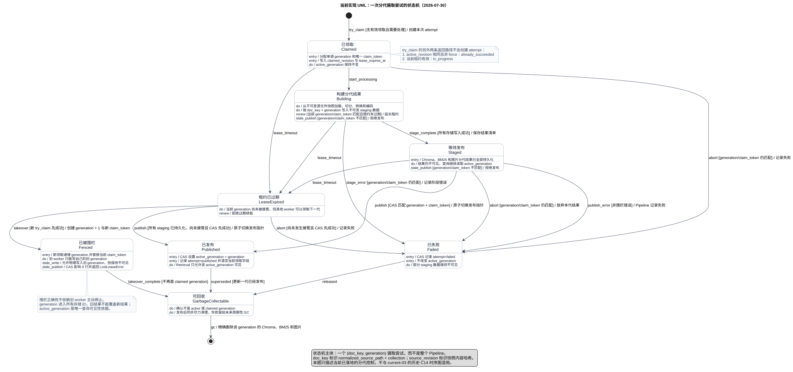

# ADR-0005：用分代写入和发布指针保护并发摄取

- **状态**：当前采用
- **日期**：2026-07-30
- **适用场景**：多个 worker 可能同时摄取文档，并且更新时旧版本仍需可查询
- **决策关系**：取代 ADR-0004 的领取身份、跨索引更新和并发发布机制；本文不修改
  `DEV_SPEC.md`

## 结论

当前代码已经按这个方案落地。它使用的是一种常见做法：

> 不直接修改用户正在使用的版本。先在旁边制作一个新版本，全部完成后，只切换一个
> “当前版本指针”。

这个思路常见于蓝绿发布、写时复制和多版本数据管理。它保证的不是“任务只执行一次”，
而是：

> 即使旧 worker 没有停止，最终也只有一个完整版本能被用户看见。

它适合多 worker、超时接管和无中断更新。代价是所有存储和查询都必须识别 generation，
并接受短期存在不可见垃圾数据。

## 先理解当前问题

ADR-0004 的初始 Pipeline 会直接修改正在使用的索引：

```text
领取任务
  -> 解析、切分和编码
  -> 删除旧 Chroma/BM25 数据
  -> 写入新 Chroma/BM25/图片数据
  -> 在 SQLite 中标记 success
```

SQLite 可以拒绝过期 worker 提交 `success`，但阻止不了它继续修改 Chroma、BM25 和图片。

```text
A 开始处理
A 超时
B 接管并写完新索引
A 恢复，又删除或覆盖了 B 的索引
A 的 success 虽然被 SQLite 拒绝，但索引已经被改坏
```

根本问题是：A 和 B 都在修改同一份“当前数据”。只保护最后一条状态记录还不够。

## 方案只做两件事

数据库主要负责：

1. 给每次摄取发一个不会重复的版本号和一次性凭证。
2. 记录用户当前应该查询哪个版本。

实际正文、向量、关键词和图片仍然存放在 Chroma、BM25 和文件系统中。

## 从第 7 版更新到第 8 版

假设 `manual.pdf` 当前公开的是第 7 版：

```text
active_generation = 7
```

### 1. A 领取任务

数据库给 Worker A 分配：

```text
generation = 8
claim_token = AAA
```

数据库中的状态可以读成：

| 文档 | 当前公开版本 | 正在制作版本 | 制作凭证 |
|------|--------------|--------------|----------|
| `manual.pdf` | 7 | 8 | `AAA` |

也就是：用户继续查询第 7 版，A 在后台制作第 8 版。

### 2. A 写入第 8 版

A 不覆盖第 7 版，而是把版本号写进所有存储身份：

```text
Chroma: manual:8:chunk-1
BM25:   manual:8:chunk-1
图片引用: (manual, 8, image-1)
```

第 8 版即使只写完一半，用户仍然只查询第 7 版，不会看到半成品。

### 3. A 发布第 8 版

全部存储写完后，A 请求数据库切换公开版本：

```text
只有“正在制作版本仍是 8，并且凭证仍是 AAA”时，才允许发布。
```

条件匹配后：

```text
active_generation = 8
claimed_generation = NULL
claim_token = NULL
```

从这一刻开始，用户才会查询第 8 版。

## A 超时、B 接管时会怎样

A 太慢，租约过期。B 接管后得到：

```text
generation = 9
claim_token = BBB
```

A 和 B 写入不同位置：

```text
A 只能写 manual:8:...
B 只能写 manual:9:...
```

B 发布成功后：

```text
active_generation = 9
```

A 随后拿着 `generation=8、claim_token=AAA` 请求发布，但数据库当前保存的是
`generation=9、claim_token=BBB`。条件不匹配，A 的发布影响 0 行。

A 的第 8 版数据可能还在磁盘上，但用户看不到它，以后由垃圾回收删除。这就是 fencing，
即“围栏”：

> 不要求旧 worker 必须立即停止，而是让它即使继续运行，也无法覆盖或发布新 worker 的
> 结果。

## 五个名字分别表示什么

| 名称 | 人话解释 | 例子 |
|------|----------|------|
| `doc_key` | 这是哪个逻辑文档 | 由规范化路径和 collection 生成 |
| `source_revision` | 本次读取的是哪份内容 | 文件快照的 SHA256 |
| `generation` | 这是该文档第几次制作，也是单调递增的围栏号 | 7、8、9，只增不减 |
| `claim_token` | 谁有权操作这一代 | 本次领取的一次性随机凭证 |
| `active_generation` | 用户应该看哪一代 | 当前公开版本 9 |

身份必须分成两层：

```text
doc_key         = SHA256(normalized_source_path + collection)
source_revision = SHA256(immutable_snapshot_bytes)
```

这样，同一路径的 V1、V2 使用同一个 `doc_key`，不会分别绕过文档级领取；内容相同但路径
不同的两个文件拥有不同 `doc_key`，也不会被错误当成同一个文档。

Loader 必须读取计算 `source_revision` 时创建的不可变快照，避免“领取时是 V1，解析时已经
变成 V2”。

## 如何阅读状态机

完整 UML：



可编辑源文件：
[`diagrams/current-04-ingestion-generation-state-machine.puml`](../../diagrams/current-04-ingestion-generation-state-machine.puml)

第一次阅读只看两条路线。

正常路线：

```text
Claimed -> Building -> Staged -> Published
已领取      构建中      写完未公开    已发布
```

超时接管路线：

```text
Building -> LeaseExpired -> Fenced
构建中        租约过期       已被新一代取代
```

| 状态 | 人话解释 | 用户看到什么 |
|------|----------|--------------|
| `Claimed` | 已拿到 generation 和 claim_token | 旧 active 版本 |
| `Building` | 正在处理并写入本代数据 | 旧 active 版本 |
| `Staged` | 本代全部写完，但还没公开 | 旧 active 版本 |
| `Published` | 发布指针已经切到本代 | 本代 |
| `LeaseExpired` | 已超时，其他 worker 可以接管 | 旧 active 版本 |
| `Fenced` | 新 worker 已接管，旧凭证作废 | 永远看不到旧 worker 的本代 |
| `Failed` | 本次失败，发布指针不变 | 旧 active 版本 |
| `GarbageCollectable` | 已确认不用，可以清理 | 不可见 |

租约过期不等于已经被接管，因此 `LeaseExpired` 有两个可能结果：

```text
A 先发布成功 -> A 进入 Published
B 先接管成功 -> A 进入 Fenced
```

两者都通过 SQLite 短写事务执行，所以数据库会决定明确的先后顺序，不会同时成功。

## 不同版本为什么不会冲突

方案不是假设内容不会冲突，而是主动把写入位置隔开。

没有 generation：

```text
A 写 manual:chunk-1
B 也写 manual:chunk-1
```

两者会覆盖。

加入 generation：

```text
A 写 manual:8:chunk-1
B 写 manual:9:chunk-1
```

两者可以同时存在。因此正常摄取不能再“按 source_path 删除全部旧数据”，只能新增自己的
generation。旧版本只能由垃圾回收按 `doc_key + generation` 精确删除。

## 查询也必须识别版本

只隔离写入还不够，查询必须只返回 active generation。

### Chroma

每个命中都必须带 `doc_key` 和 `generation`：

```text
第 7 版命中 -> 不是 active -> 丢弃
第 8 版命中 -> 不是 active -> 丢弃
第 9 版命中 -> 是 active   -> 返回
```

旧版本可能占据前面的候选，因此需要过量召回、过滤后不足再继续取，并及时回收旧版本。

### BM25

BM25 会计算全局文档数、词频和 IDF。旧 generation 如果仍参与统计，即使最后过滤掉旧
命中，分数也已经被污染。

当前 `BM25Indexer` 的磁盘快照可以同时保存多个 generation。查询先取得
`active_generation` 清单，只用 active 文档重新计算 N、df、IDF 和平均长度，再计算命中。
写入使用进程内路径锁、跨进程 `flock` 和原子换档，避免多个实例基于旧快照互相覆盖。

### 图片

图片引用必须包含 generation：

```text
(doc_key, generation, image_id) -> 内容寻址图片文件
```

当前图片文件仍由 Loader 按内容哈希命名，相同内容可以跨 generation 共享；SQLite
`image_versions` 表负责隔离分代引用。查询文档图片时，只返回 active generation；删除旧代
引用时，只有确认没有其他引用后才删除共享文件。

## 失败为什么不会破坏旧版本

| 失败位置 | 结果 |
|----------|------|
| 只写完 Chroma 就崩溃 | 新一代不可见，继续查询旧 active 版本 |
| Chroma 成功、BM25 失败 | 不发布新一代，Dense/BM25 都继续使用旧版本 |
| 发布后进程崩溃 | 新一代已经完整发布，进程退出不影响结果 |
| 旧 worker 恢复 | 只能写旧 generation，claim_token 不匹配，不能发布 |

这个方案不要求 Chroma、BM25、图片和 SQLite 参加同一个大事务。它通过“先写不可见版本，
全部成功后再切换可见性”达到相同的用户效果。

## 垃圾回收

分代写入会暂时保留旧数据。只有同时满足以下条件才允许删除：

```text
不是 active_generation
不是 claimed_generation
```

当前 Pipeline 在新 generation 发布后执行一次同步、尽力而为的清理：分别以
`doc_key + generation` 精确删除 Chroma、BM25 和图片引用。任一清理失败只记录 warning，
不能回滚已经发布的 active 指针；摄取尝试历史继续留在 SQLite 供审计。

同步清理不是完整的长期 GC。旧 worker 可能在清理结束后才补写自己的 fenced generation，
因此未来仍需增加周期性 GC 和保留期。本次实现先保证“垃圾永远不可见且不会误删 active
或 claimed”，不把磁盘最终一定无垃圾作为已完成能力。

## 这个方案合理在哪里

| 收益 | 代价 |
|------|------|
| 旧 worker 无法覆盖新结果 | 所有存储都要增加 generation |
| 更新失败时旧版本继续可查 | 磁盘暂时保留多个版本 |
| 不需要跨 Chroma/BM25/SQLite 的大事务 | Retrieval 必须检查 active generation |
| 可以安全接管超时任务 | 仍需周期性垃圾回收 |
| 可以并行构建不同文档 | BM25 需要重新设计并发写入和统计 |

所以它是合理的生产级一致性基础，但不是免费方案。当前实现完成了分代隔离、条件发布和
查询可见性；周期性 GC、自动续租以及 Dense 分页补召回仍属于后续演进项。

## 必须遵守的九条规则

少一条都不能声称方案正确：

1. 同一个 `doc_key` 最多只有一个当前 claimed generation。
2. generation 只增不减，失败后也不能复用。
3. generation 必须进入 Chroma、BM25 和图片的存储身份。
4. 写新 generation 时不能删除或覆盖 active generation。
5. 只有 generation/claim_token 同时匹配的 worker 可以续租、失败或发布。
6. Retrieval 永远不能返回非 active generation。
7. BM25 的统计只能基于 active generation。
8. GC 永远不能删除 active 或 claimed generation。
9. 领取哈希和 Loader 输入必须来自同一个不可变文件快照。

## 当前落地范围

1. Pipeline 创建保留扩展名的临时快照，哈希和 Loader 始终读取同一份字节。
2. SQLite 保存 `document_state`、`ingestion_attempt` 和完整 `ClaimHandle`。
3. Chroma、BM25 和图片引用按 generation 追加写入，不再先清空 active 数据。
4. Pipeline 在三路存储都完成后执行 `mark_staged()` 和 generation/claim_token CAS 发布。
5. Dense、BM25 和图片查询根据同一个 `GenerationStateStore` 丢弃非 active 数据。
6. 发布后执行 generation 级同步尽力清理；周期性 GC 延后。
7. `renew_lease()` 已提供控制面能力，Pipeline 暂未引入后台心跳线程。

## 验收场景

1. A 超时，B 接管并发布；A 随后写完，查询仍只能返回 B。
2. A 只写完 Chroma 就崩溃；Dense 和 BM25 仍共同查询旧 active 版本。
3. 同一路径 V1、V2 使用同一个 `doc_key`，不能分别绕过文档级领取。
4. 两个不同文档并发摄取时，BM25 不丢记录，统计不包含非 active generation。
5. 文件在请求期间变化时，Loader 读取内容仍与 `source_revision` 一致。
6. GC 与摄取并发时，不删除 active 或 claimed generation；过期 worker 后写的垃圾保持不可见。
7. 发布成功后，即使进度回调或响应发送失败，数据库仍保持 Published 状态。

## 技术附录

以下内容对应当前控制面实现，第一次理解方案时可以先跳过。

<details>
<summary>查看建议的数据表和条件发布 SQL</summary>

### 文档当前状态

`document_state` 只保存“当前公开版本”和“当前领取”：

```sql
CREATE TABLE document_state (
    doc_key TEXT PRIMARY KEY,
    collection TEXT NOT NULL,
    source_path TEXT NOT NULL,
    active_generation INTEGER,
    active_revision TEXT,
    last_generation INTEGER NOT NULL DEFAULT 0,
    claimed_generation INTEGER,
    claimed_revision TEXT,
    claim_token TEXT,
    lease_owner TEXT,
    lease_expires_at REAL,
    updated_at TEXT NOT NULL DEFAULT CURRENT_TIMESTAMP
);
```

### 每次尝试的历史

```sql
CREATE TABLE ingestion_attempt (
    doc_key TEXT NOT NULL,
    generation INTEGER NOT NULL,
    source_revision TEXT NOT NULL,
    claim_token TEXT NOT NULL,
    status TEXT NOT NULL,
    error_msg TEXT,
    chunk_count INTEGER,
    started_at TEXT NOT NULL DEFAULT CURRENT_TIMESTAMP,
    finished_at TEXT,
    PRIMARY KEY (doc_key, generation)
);
```

`LeaseExpired` 等状态可以由时间字段推导，状态机名称不要求全部逐字存进数据库。

### 领取凭证

```python
@dataclass(frozen=True)
class ClaimHandle:
    doc_key: str
    generation: int
    source_revision: str
    claim_token: str
    lease_owner: str
    lease_expires_at: float
```

后续的 `renew_lease()`、`mark_failed()` 和 `publish()` 都接收这份完整凭证。

### 条件发布

```sql
UPDATE document_state
SET active_generation = :generation,
    active_revision = :source_revision,
    claimed_generation = NULL,
    claimed_revision = NULL,
    claim_token = NULL,
    lease_owner = NULL,
    lease_expires_at = NULL,
    updated_at = CURRENT_TIMESTAMP
WHERE doc_key = :doc_key
  AND claimed_generation = :generation
  AND claim_token = :claim_token;
```

`WHERE` 是门卫。影响 1 行表示发布成功；影响 0 行表示已被接管，必须返回
`LostLeaseError`。

这里不强制检查租约是否仍在有效期：租约过期但没人接管时，旧 worker 仍可抢先完成发布；
新 worker 一旦先接管，generation/claim_token 会变化，旧发布自然失败。

</details>

## 与当前实现的关系

- ADR-0004 和 `current-03-*` 保留 C14 初始“按文档删除再覆盖”的历史基线；其中并发发布
  与跨索引更新机制已被本文取代。
- 当前状态机见
  [`current-04-ingestion-generation-state-machine.puml`](../../diagrams/current-04-ingestion-generation-state-machine.puml)，
  可视图见
  [`current-04-ingestion-generation-state-machine.svg`](../../diagrams/current-04-ingestion-generation-state-machine.svg)。
- `tests/integration/test_ingestion_pipeline.py` 覆盖不可变快照、失败保留旧 active、A 超时后
  B 接管发布、A 迟到写入仍不可见，以及发布后完成回调失败不回滚。
- 当前全量回归为 `179 passed, 5 skipped`；本次涉及文件通过 Ruff、Mypy、compileall 和
  `git diff --check`，三个 `current-*` PlantUML 文件均已校验并重新渲染 SVG。
